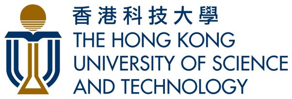

## About Me

I'm Siyuan Duan, currently a master's student at the College of Computer Science, [Sichuan University (SCU)](https://cs.scu.edu.cn/) , fortunately advised by Prof. [Dezhong Peng](https://cs.scu.edu.cn/info/1282/13563.htm) & Prof. [Peng Hu](https://penghu-cs.github.io). 

I am also an incoming Ph.D candidate in the Department of Computer Science and Engineering at [The Hong Kong University of Science and Technology (HKUST)](https://hkust.edu.hk/) . I will conduct my doctoral studies at the department’s [Smart Lab](https://smartlab.cse.ust.hk/) under the supervision of Prof. [Hao Chen](https://cse.hkust.edu.hk/~jhc/).

## Research Interests

- **Multi-modal Learning:** Including cross-modal retrieval and multi-view classification.
- **AI for Science:** Utilizing Physics-Informed Neural Networks (PINNs) for solving PDE problems.

🌟 **If you are interested in collaborating with me or want to have a chat, please feel free to contact me via email**.

<h2>News</h2> <!-- 标题固定 -->

  <ul>
    <li><strong>[10/2025]</strong> I got a PhD offer from <a href="https://cse.hkust.edu.hk/">HKUST CSE</a>. </li>
    <li><strong>[07/2025]</strong> I gave a talk at the <a href="https://www.aitime.cn/">AI TIME</a> pre-talk and introduced our <a href="https://github.com/siyuancncd/FUML">FUML (ICML'25)</a>. You can see <a href="https://www.bilibili.com/video/BV1mA3yzEEWF/?spm_id_from=333.1387.homepage.video_card.click&vd_source=6c3619d976449503d4bb811d9044ee7f&t=5481">here</a>.</li>
    <li><strong>[05/2025]</strong> Amazing! 2 papers were accepted to <strong>ICML 2025</strong>! One was accepted as Spotlight (acc rate = 2.6%)! Thanks to all coauthors. 🎉</li>
    <li><strong>[02/2025]</strong> 1 paper was accepted to <strong>CVPR 2025</strong>(acc rate = 22.1%)! Thanks to all coauthors. 🎉</li>
    <li><strong>[09/2024]</strong> 1 paper was accepted to <strong>Neural Networks</strong>. Thanks to all coauthors. 🎉</li>
  </ul>





## Honors and Awards 🏆

- National Scholarship (Top 1%), 2020.
- National Scholarship (Top 2%), 2025.
