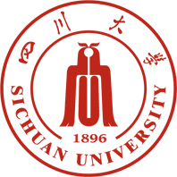
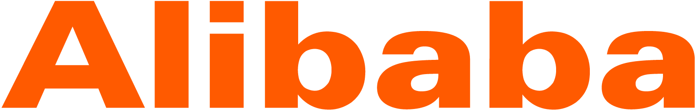

 
Welcome to my personal homepage. I'm currently a master's student at the College of Computer Science,  [Sichuan University (SCU)](https://cs.scu.edu.cn/), fortunately advised by Prof. [Dezhong Peng](https://cs.scu.edu.cn/info/1282/13563.htm) & Prof. [Peng Hu](https://penghu-cs.github.io). I'm also an incoming Ph.D student at the Department of Computer Science and Engineering,  [The Hong Kong University of Science and Technology (HKUST)](https://hkust.edu.hk/). I will conduct my doctoral studies under the supervision of Prof. [Hao Chen](https://cse.hkust.edu.hk/~jhc/).

<!--
## Research Interests

- **Multi-modal Learning:** Including cross-modal retrieval and multi-view classification.
- **AI for Science:** Utilizing Physics-Informed Neural Networks (PINNs) for solving PDE problems.
-->

🌟 **I'm currently concentrating on research in the Large Vision Language Model (LVLM). If you are interested in collaborating with me or want to have a chat, please feel free to contact me via <a href="mailto:siyuanduancn@gmail.com">email</a> !**

<h2>News</h2> <!-- 标题固定 -->

  <ul>
    <li><strong>[10/2025]</strong> I got a PhD offer from <a href="https://cse.hkust.edu.hk/">HKUST CSE</a>. </li>
    <li><strong>[07/2025]</strong> I gave a talk at the <a href="https://www.aitime.cn/">AI TIME</a> pre-talk and introduced our <a href="https://github.com/siyuancncd/FUML">FUML (ICML'25)</a>. You can see <a href="https://www.bilibili.com/video/BV1mA3yzEEWF/?spm_id_from=333.1387.homepage.video_card.click&vd_source=6c3619d976449503d4bb811d9044ee7f&t=5481">here</a>.</li>
    <li><strong>[05/2025]</strong> Amazing! 2 papers were accepted to <strong>ICML 2025</strong>! One was accepted as Spotlight (acc rate = 2.6%)! Thanks to all coauthors. 🎉</li>
    <li><strong>[02/2025]</strong> 1 paper was accepted to <strong>CVPR 2025</strong>(acc rate = 22.1%)! Thanks to all coauthors. 🎉</li>
    <li><strong>[09/2024]</strong> 1 paper was accepted to <strong>Neural Networks</strong>. Thanks to all coauthors. 🎉</li>
  </ul>



## Industrial Experience

<!-- 
- Jan. 2026 - Now: **Research Intern** @  Taobao&Tmall Group in , Beijing, China. **Topic**: Vision-Language Models (VLMs).
-->

  <!-- 左侧Logo（与右侧文字顶部对齐，保持原有样式） -->
  <!-- 
   -->
  
  <!-- 右侧两行文本容器：纵向排列，确保两行左端对齐 -->
  

    <!-- 第一行：公司信息 + 带间距的日期 -->
    
      <strong>Research Intern</strong> @ Taobao&Tmall Group of Alibaba
      <!--  -->
      <!-- 日期移到第一行，通过margin-left设置与前面文字的间距 -->
      Jan. 2026 - Now
    
    <!-- 第二行：仅保留Topic信息，自然左端对齐 -->
    <strong>Topic</strong>: Large Vision Language Model (LVLM).
  

## Services

- Conference Reviewer: ACL ARR, NeurIPS.

## Honors and Awards 🏆
- Full Postgraduate Studentship (2026 - 2030)
- China National Scholarship (2025, 2020)

<!--   -->
---

