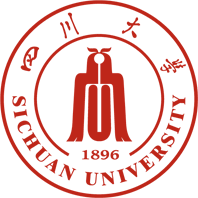

<!--   -->
Welcome to my personal homepage. I'm currently a first-year Ph.D student at the Department of Computer Science and Engineering (CSE),  [The Hong Kong University of Science and Technology (HKUST)](https://hkust.edu.hk/), supervised by Prof. [Hao Chen](https://cse.hkust.edu.hk/~jhc/). Previously, I gained valuable experience as a research intern at [Alibaba Group](https://www.alibabagroup.com/en-US).

<!--
I'm currently a master's student at the College of Computer Science,  [Sichuan University (SCU)](https://cs.scu.edu.cn/), fortunately advised by Prof. [Dezhong Peng](https://cs.scu.edu.cn/info/1282/13563.htm) & Prof. [Peng Hu](https://penghu-cs.github.io).
-->

<!--
I am actively seeking a PhD program starting in the 2026 Fall or 2027 spring. If you are interested in me, please feel free to contact me via <a href="mailto:siyuanduancn@gmail.com">email</a> !
-->

<!--
I'm also an incoming Ph.D student at the Department of Computer Science and Engineering,  [The Hong Kong University of Science and Technology (HKUST)](https://hkust.edu.hk/). I will conduct my doctoral studies under the supervision of Prof. [Hao Chen](https://cse.hkust.edu.hk/~jhc/).
-->

<!--
## Research Interests

- **Multi-modal Learning:** Including cross-modal retrieval and multi-view classification.
- **AI for Science:** Utilizing Physics-Informed Neural Networks (PINNs) for solving PDE problems.
-->

🌟 **I'm currently concentrating on research in the Large Vision Language Model (LVLM) and the Foundation Model for Healthcare. If you are interested in collaborating with me or want to have a chat, please feel free to contact me via <a href="mailto:siyuanduancn@gmail.com">email</a> !**

<h2 id="news">News</h2> <!-- 标题固定 -->

  <ul>
    <li><strong>[01/2026]</strong> I start my intern at Alibaba group. </li>
    <li><strong>[10/2025]</strong> I got a PhD offer from <a href="https://cse.hkust.edu.hk/">HKUST CSE</a>. </li>
    <li><strong>[07/2025]</strong> I gave a talk at the <a href="https://www.aitime.cn/">AI TIME</a> pre-talk and introduced our <a href="https://github.com/siyuancncd/FUML">FUML (ICML'25)</a>. You can see <a href="https://www.bilibili.com/video/BV1mA3yzEEWF/?spm_id_from=333.1387.homepage.video_card.click&vd_source=6c3619d976449503d4bb811d9044ee7f&t=5481">here</a>.</li>
    <li><strong>[05/2025]</strong> Amazing! 2 papers were accepted to <strong>ICML 2025</strong>! One was accepted as Spotlight (acc rate = 2.6%)! Thanks to all coauthors. 🎉</li>
    <li><strong>[02/2025]</strong> 1 paper was accepted to <strong>CVPR 2025</strong>(acc rate = 22.1%)! Thanks to all coauthors. 🎉</li>
    <li><strong>[09/2024]</strong> 1 paper was accepted to <strong>Neural Networks</strong>. Thanks to all coauthors. 🎉</li>
  </ul>



## Industrial Experience
{:#experience}

<!-- 
- Jan. 2026 - Now: **Research Intern** @  Taobao&Tmall Group in , Beijing, China. **Topic**: Vision-Language Models (VLMs).
-->

  
  <!-- 右侧两行文本容器：纵向排列，确保两行左端对齐 -->
  

    <!-- 第一行：公司信息，日期在右侧对齐 -->
    

      
      <strong>Research Intern</strong> @ Taobao&Tmall Group of Alibaba
      
      Jan. 2026 - Jul. 2026
    

    <!-- 第二行：仅保留Topic信息，自然左端对齐 -->
    <strong>Topic</strong>: <em>Large Vision Language Model (LVLM).</em>
  

## Services
{:#services}

<ul class="info-card-list">
  <li><strong>Conference Reviewer:</strong> <em>NeurIPS, AAAI, ACL ARR.</em></li>
  <li><strong>Journal Reviewer:</strong> <em>ACM TOIS, Neurocomputing.</em></li>
</ul>

## Honors & Awards
{:#honors}

<ul class="info-card-list">
  <li>Full Postgraduate Studentship @ HKUST (2026 - 2029(expected))</li>
  <li>China National Scholarship (2025 @ SCU, 2020 @ CAFUC)</li>
</ul>

<!--   -->
---
Cutest pup, right here!

